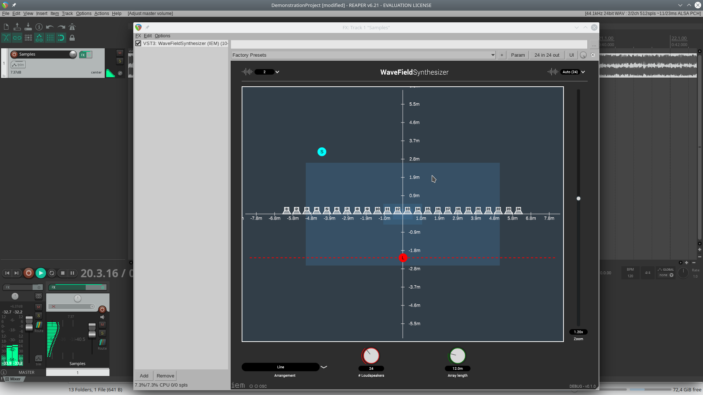

#  Intro about this repo
This repository was imported from Gitlab (you can find it here: https://git.iem.at/audioplugins/iem-wfs ). The source code  was then written by the IEM Plug-in Suite Team, a 3D audio company (home page: https://plugins.iem.at / ).
I simply adapted the code to make it compatible with the use of Juce 8.0.10 for producing plugins in VST3, VST2, AAX, and LV2 formats, and for using ASIO and Jack4Win drivers, all for Windows. The update was limited to a few changes to the Jucer file and some more significant changes to the "MyStandaloneFilterWindow.h" header.
I used Windows 11, the asiosdk v2.3.3 of 2019-06-14, Jack2 v1.9.x (Jack2 must be installed on the system), added the directories related to asio and jack to the search for headers Juce tab (check your directories and possibly correct the ones inserted from the Juce gui). I added also the preprocessor_definitions macros "JUCE_FORCE_WINRT_MIDI=1" and "JUCE_MODAL_LOOPS_PERMITTED=1" from the related Juce GUI tab.
Check Steinberg's guidelines for using/producing VST2. Also remember that to use AAX plugins, you must activate it following a specific procedure established by Avid, which requires Avid and iLok accounts, as well as the use of specific tools like iLok, AAX Validator, and Pro Tools Developer.

#  Original Readme:

#  WaveFieldSynthesizer 

This audio plugin implements a wave-field synthesis for an arbitrary loudspeaker array. The wave-field synthesis parameters are controllable via GUI and via automation. The plugin is free and open-source.

## Demo video

## Installation Guide

You don't need to install the plugin. Simply move the VST file to your local VST plugin folder.

- Windows: C:\Program Files\Common Files\VST3 or C:\Programm Files\Steinberg\VstPlugins 
- MacOS: /Library/Audio/Plug-Ins/Components or /Library/Audio/Plug-Ins/VST
- Linux: ~/.vst3 or /usr/local/lib/lxvst

After adding the plugin you need to restart your DAW, and occasionally re-scan for new VSTs.

## Compilation Guide

For compiling the plugin you need the [JUCE framework](https://juce.com), a C++ environment and an IDE. 
For Windows you need Visual Studio (with C++ tools installed), for MacOS you need XCode). For Linux it is enough to use Unix Makefile support.

To generate the build files, you have to open the [WaveFieldSynthesizer.jucer](WaveFieldSynthesizer.jucer) file and save the project. This generates the build files for all operating systems in the *Build/* directory.

The project builds a VST version as well as a Standalone version. Usually you will use the VST version in your favourite DAW. For simple testing the Standalone is useful though.

### Step-by-step

- Clone or download this repository
- Open the [WaveFieldSynthesizer.jucer](WaveFieldSynthesizer.jucer] file 
- Export the build files by saving the project ("File" -> "Save")
- **For Windows:** Open the VisualStudio2017/2019 solution in *Build/* and build the VST3 target
- **For MacOS:** Open the XCode file in *Build/* and build the VST3 target
- **For Linux:** Open a terminal, navigate into the Linux Makefile directory in *Build/*, then "make"

### JACK support

The Standalone version is built with JACK support on MacOS and Linux. You can also choose to disable the JACK support by adding `DONT_BUILD_WITH_JACK_SUPPORT=1` to the Preprocessor Definitions in the Projucer project.

## Binaural listening

Wave-field synthesis usually uses a lot of loudspeakers, which are normally not available in home setups. It's possible to use the plugin for binaural listening too. You need the following signal chain:

- Audio track (preferably Mono, more channels possible)
- WaveFieldSynthesizer
- Binaural rendering plugin with the corresponding loudspeakers-to-binaural impulse responses

### Binaural rendering plugin

One possible plugin is Matthias Kronlachner's [mcfx_convolver](https://github.com/kronihias/mcfx) (binaries available [here](http://www.matthiaskronlachner.com/?p=1910)). You can use any binaural rendering plugin though.

Additionally you need impulse responses. You can find some for Binaural and for Ambisonics 1st order [under this link ](http://soundaroundcloud.ddns.net:8000/index.php/s/jgJEs5C5FNN9RWt). The impulse responses were recorded using a linear 24 loudspeaker array and 5 different listener positions.

Additionally you need a configuration file for the rendering plugin. In the [Misc directory](Misc) you find one for each of the 5 recorded listening positions. Use it together with the *mcfx_convolver*. 
In the GUI the listening position must be set to the recorded position. The Y-coordinate is the same for every position (-2m) whereas the x-coordinate should be set to (from position 1 to 5) -1.8m | -0.9m | 0.0m | 0.9m | 1.9m. For more details read the [dokucmentation on the binaural impulse responses](Misc/DocumentationBRIR.pdf).

## Possible issues

If you build on Windows, a file path in the build process may become too long. Visual Studio then throws an error. If this happens, try moving the repository to a shorter path, e.g. *C:/*.

## Related work

For a comprehensive guide on modern wave field synthesis, see [Gergely Firtha's PhD thesis](https://repozitorium.omikk.bme.hu/bitstream/handle/10890/13177/tezis_eng.pdf?sequence=3&isAllowed=y).

## Maintainers

- [Lukas Maier](mailto:maier.lukas1995@gmail.com)
- [Michael Reiter](mailto:michael.reiter94@gmail.com)

## Special thx to

- **Lukas Goelles**: For working on and prototyping the algorithm this plugin is based on.
- **Franz Zotter**: For supervising and always providing useful input.

